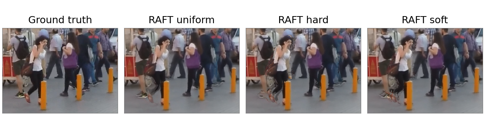

**Abstract.** This study examines the effect of forward–backward optical flow consistency on video frame interpolation using a pretrained RAFT model. Uniform weights for geometrically valid correspondences are compared with a binary mask and continuous weighting. The flow fields, bilinear splatting operator, and hole-filling rule remain the same across all variants. On 1,240 SNU-FILM triplets, the RAFT uniform baseline achieves higher mean PSNR and SSIM and lower mean LPIPS in all four difficulty subsets. Binary weighting reduces mean PSNR by 0.872 dB, and continuous weighting reduces it by 0.607 dB. The fraction of pixels requiring fallback filling is 1.14% for uniform, 8.32% for hard, and 3.98% for soft. At the specified thresholds, consistency checking does not improve the quality of this interpolation scheme.

**Keywords:** video frame interpolation, optical flow, RAFT, motion consistency, occlusion, forward splatting.

# 1 Introduction

Video frame interpolation reconstructs an image at a time between two observed frames. Motion estimation errors cause misplaced details, blurring, and ghosting. In occluded regions, a surface may be visible in only one input image, so combining the frames requires accounting for differences in correspondence reliability.

In computer graphics, a frame generator can receive additional data from the rendering engine. For example, the AMD FSR Frame Generation interface includes depth buffers, motion vectors, and camera parameters [1]. Ordinary RGB video does not provide these data alongside the images. Optical flow can be estimated from the frames, but this does not make the estimated fields equivalent to engine data or establish compatibility with engine interfaces.

This study considers a standalone interpolation scheme based on RAFT [2]. Motion estimation and image synthesis are separated so that pixel weighting can be changed while the flow fields remain fixed. The research question is how forward–backward consistency checking affects reconstruction quality and the fraction of the image that requires fallback filling.

Optical flow transport is already used for interpolation, including in Softmax Splatting [3]. Consistency checking is also established: UnFlow uses it to construct occlusion masks during training [4]. Here, these principles are used in a controlled comparison of weighting rules.

# 2 Flow estimation and consistency

Let $I_0,I_1:\Omega\rightarrow[0,1]^3$ be the input RGB images, where $\Omega$ is their common pixel grid. The task is to reconstruct $\widehat I_t$ at $t=0.5$. The ground-truth middle frame $I_t$ is used only to compute evaluation metrics. Applying RAFT in both directions gives

$$F_{01}=\operatorname{RAFT}(I_0,I_1),\qquad F_{10}=\operatorname{RAFT}(I_1,I_0). \qquad (1)$$

The vector $F_{01}(\mathbf x)$ is measured in pixels and specifies the displacement from position $\mathbf x$ in the first frame to the second frame. The backward flow is defined on the second frame's grid. Consistency checking therefore requires sampling it at $\mathbf x+F_{01}(\mathbf x)$, rather than at the original position. Bilinear interpolation $\mathcal B$ is used for noninteger coordinates:

$$\widetilde F_{10}(\mathbf x)=\mathcal B(F_{10},\mathbf x+F_{01}(\mathbf x)),\qquad
e_0^2(\mathbf x)=\|F_{01}(\mathbf x)+\widetilde F_{10}(\mathbf x)\|_2^2. \qquad (2)$$

The residual $e_1^2$ is computed analogously by swapping the flow directions. Define a geometric validity mask $V_0$ that equals one when $\mathbf x+F_{01}(\mathbf x)$ lies within the image and zero otherwise. The mask $V_1$ is defined symmetrically. This check is applied in every variant to separate the effect of consistency checking from that of rejecting out-of-bounds correspondences.

The residual is normalized using a motion-dependent threshold based on the UnFlow criterion [4]:

$$D_0(\mathbf x)=\alpha\bigl(\|F_{01}(\mathbf x)\|_2^2+\|\widetilde F_{10}(\mathbf x)\|_2^2\bigr)+\beta. \qquad (3)$$

The parameters were fixed before the experiment at $\alpha=0.01$ and $\beta=0.5$ square pixels. These values match the criterion in [4], but are not assumed to be optimal for interpolation. Three weights are defined from the same residual:

$$w_0^{\mathrm{uniform}}=V_0,\qquad
w_0^{\mathrm{hard}}=V_0\,\mathbf1[e_0^2\leq D_0],\qquad
w_0^{\mathrm{soft}}=V_0\exp(-e_0^2/D_0). \qquad (4)$$

Here, $\mathbf1[\cdot]$ is the indicator function. The continuous weight is a heuristic to be evaluated, rather than a probability that a correspondence is correct. The second image uses $V_1$, $e_1^2$, and $D_1$. Out-of-bounds coordinates receive zero weight; the interpolated backward flow at such positions is not interpreted.

The implementation uses RAFT Large with the explicitly selected Torchvision C_T_V2 weights, trained on FlyingChairs and FlyingThings3D [5]. Flow estimation uses 20 refinement iterations and float32 arithmetic. Images are padded on the right and bottom to dimensions that are multiples of eight and at least 128 pixels. Values are normalized to $[-1,1]$, and the padding is removed after flow estimation. Images are not resized.

# 3 Intermediate frame synthesis

Motion is assumed to follow a linear trajectory between the input times. A pixel in the first frame is moved to $\mathbf x+tF_{01}(\mathbf x)$, and a pixel in the second frame to $\mathbf x+(1-t)F_{10}(\mathbf x)$. This is a forward mapping from the input image; simply negating the flow is not used to construct an inverse mapping.

Let $\mathcal S_d(A,w)$ denote accumulation of weighted values $A$ on the target grid under displacement $d$. The contribution to the four neighboring pixels is determined by the bilinear kernel $k(\mathbf z)=\max(0,1-|z_x|)\max(0,1-|z_y|)$:

$$\mathcal S_d(A,w)(\mathbf y)=\sum_{\mathbf x\in\Omega}
k(\mathbf y-\mathbf x-d(\mathbf x))w(\mathbf x)A(\mathbf x). \qquad (5)$$

Contributions outside the target grid are discarded. Let $d_0=tF_{01}$ and $d_1=(1-t)F_{10}$. The numerator $N_t$ and accumulated weight $Z_t$ combine contributions from both images:

$$\begin{aligned}
N_t&=(1-t)\mathcal S_{d_0}(I_0,w_0)+t\mathcal S_{d_1}(I_1,w_1),\\
Z_t&=(1-t)\mathcal S_{d_0}(1,w_0)+t\mathcal S_{d_1}(1,w_1).
\end{aligned}\qquad (6)$$

Where $Z_t>10^{-8}$, the output is $N_t/Z_t$. All other pixels use the same fallback rule, $(1-t)I_0+tI_1$. This defines an output value everywhere, but can produce ghosting. The fraction of pixels with $Z_t\leq10^{-8}$ is therefore recorded before filling. Differences in this fraction show how much of the image is produced by the fallback rule.

When the consistency residual is zero, the binary and continuous weights equal the uniform baseline weights for geometrically valid correspondences. All three schemes then produce the same image. Differences arise when the flows are inconsistent. This special case is used to check the implementation, together with zero motion, integer translation, and subpixel distribution of contributions.

# 4 Experimental method

The evaluation used 1,240 SNU-FILM triplets, with 310 in each of the Easy, Medium, Hard, and Extreme subsets. Mean motion magnitude increases from Easy to Extreme [6]. According to the recorded identifiers, each of the 31 video sequence groups contributes ten triplets to each subset. All variants processed the same triplets, and the ground-truth middle frame was used only for evaluation. Threshold parameters were not changed after inspecting the results. An additional baseline computed the arithmetic mean of the input frames. A comparison with a pretrained RIFE model [7] was not part of this experiment.

PSNR was computed from the mean squared error over RGB values in $[0,1]$. SSIM used an $11\times11$ Gaussian window, $\sigma=1.5$, constants $0.01$ and $0.03$, population covariance, and averaging across color channels [8]. A five-pixel border was excluded when averaging the SSIM map. LPIPS was computed with AlexNet and metric version 0.1 [9]. Metrics and the fallback fraction were computed for each triplet and then averaged within each difficulty subset. Because the subsets have equal size, the mean over all triplets also equals the mean of the four subset averages.

The experiment ran on an NVIDIA GeForce RTX 3050 Laptop GPU with 6 GB of memory. The software environment comprised Python 3.12.3, PyTorch 2.6.0+cu124, Torchvision 0.21.0+cu124, NumPy 2.5.2, SciPy 1.18.1, and LPIPS package 0.1.4. The run log records implementation commit 2e3b7f1 and the C_T_V2 checkpoint checksum. The dataset contained eight original image resolutions, with a maximum of $1280\times720$; no resizing was applied.

The time for one output included both RAFT estimates, CPU–GPU data transfers, weight computation, and synthesis. File reading, model loading, and metric computation were excluded. Two warmup passes were performed for each image size. The flows were computed once per triplet and reused for uniform, hard, and soft, but the full flow estimation cost was included in the reported time for each variant. Splatting used NumPy on the CPU, so the timings describe a mixed CPU/GPU implementation.

# 5 Results

The run log contains 4,960 quality records: 1,240 triplets evaluated with four variants. All 2,480 recorded paired differences for hard and soft relative to uniform matched the differences between the corresponding per-triplet records. Recomputing the means reproduced every value in the summary table.

Table 1 Interpolation quality on SNU-FILM with 310 triplets per difficulty subset

| Difficulty | Variant | PSNR, dB | SSIM | LPIPS | Fallback, % |
|:--|:--|--:|--:|--:|--:|
| Easy | Average | 32.430 | 0.9038 | 0.0603 | — |
| Easy | RAFT uniform | **37.496** | **0.9787** | **0.0288** | 0.23 |
| Easy | RAFT hard | 36.575 | 0.9767 | 0.0308 | 2.69 |
| Easy | RAFT soft | 36.899 | 0.9776 | 0.0303 | 0.65 |
| Medium | Average | 28.075 | 0.8315 | 0.0909 | — |
| Medium | RAFT uniform | **33.732** | **0.9578** | **0.0433** | 0.54 |
| Medium | RAFT hard | 32.769 | 0.9537 | 0.0470 | 5.55 |
| Medium | RAFT soft | 33.075 | 0.9555 | 0.0465 | 1.67 |
| Hard | Average | 24.509 | 0.7534 | 0.1363 | — |
| Hard | RAFT uniform | **29.087** | **0.8906** | **0.0717** | 1.23 |
| Hard | RAFT hard | 28.211 | 0.8841 | 0.0773 | 10.34 |
| Hard | RAFT soft | 28.461 | 0.8867 | 0.0772 | 4.78 |
| Extreme | Average | 21.643 | 0.6800 | 0.1999 | — |
| Extreme | RAFT uniform | **24.701** | **0.7850** | **0.1205** | 2.57 |
| Extreme | RAFT hard | 23.973 | 0.7770 | 0.1289 | 14.69 |
| Extreme | RAFT soft | 24.154 | 0.7796 | 0.1291 | 8.82 |

The best mean PSNR, SSIM, and LPIPS values within each subset are shown in bold. “Fallback” is the mean fraction of pixels where $Z_t\leq10^{-8}$ and the arithmetic mean of the input frames is used. This quantity is not defined for the Average baseline.

RAFT uniform outperforms frame averaging on all three metrics in every subset. Its PSNR advantage ranges from 3.057 dB in Extreme to 5.657 dB in Medium. Binary and continuous weighting reduce mean quality relative to uniform on all three metrics in every subset. The PSNR reductions range from 0.728 to 0.963 dB for hard and from 0.546 to 0.657 dB for soft.

Across all 1,240 triplets, mean PSNR is 31.254 dB for uniform, 30.382 dB for hard, and 30.647 dB for soft. The corresponding SSIM values are 0.9030, 0.8979, and 0.8998, and LPIPS values are 0.0661, 0.0710, and 0.0707. Binary weighting improves PSNR relative to uniform in 83 of 1,240 cases (6.7%); continuous weighting does so in 155 cases (12.5%). When the four subsets are combined within each sequence group, the mean PSNR difference is negative for both weighted variants in all 31 recorded groups. These descriptive comparisons do not require treating triplets from the same sequence as independent.

The fallback fraction increases with motion difficulty. In Extreme, it reaches 2.57% for uniform, 14.69% for hard, and 8.82% for soft. The means over the complete dataset are 1.14%, 8.32%, and 3.98%, respectively. Changing the weights therefore increases the portion of the image produced by simple averaging. The association between this increase and lower quality scores is consistent with the hypothesis that useful contributions are removed, but does not establish how much of the error is caused by the fallback rule.

Figure 1 shows a crop from extreme_00001 in sequence group GOPR0384_11_00. This identifier was selected before the full run as the first example in its subset; the crop was selected during analysis. All variants show distortions around moving people, while hard and soft exhibit additional disruptions along leg contours. Full-frame PSNR is 22.837 dB for uniform, 22.426 dB for hard, and 22.640 dB for soft. The figure illustrates one case and does not replace evaluation over the full dataset.

{width=6.8in}

Mean time per output is 2.269 s for uniform, 2.458 s for hard, and 2.458 s for soft. The increase relative to uniform is approximately 8.3–8.4%. These descriptive values come from one run of a mixed CPU/GPU implementation across eight resolutions. They do not characterize an implementation running entirely on the GPU or support conclusions about energy consumption.

# 6 Discussion and conclusions

Consistency checking concerns correspondences between the two input frames. A surface occluded in the second frame may still be visible at the intermediate time, so rejecting it can remove useful information. A small consistency residual also does not guarantee correct motion: two incorrect flows can be mutually consistent. The measurements show a limitation of using this criterion directly as a synthesis weight with a fixed fallback rule.

The conclusion applies to RAFT Large C_T_V2, $\alpha=0.01$, $\beta=0.5$, and the specified weight formulas. Other thresholds, learned image fusion, and alternative hole restoration were not studied. Linear trajectories, flow errors, and simple averaging in holes limit all three variants. SNU-FILM under this evaluation protocol does not measure temporal flicker or occlusion-mask accuracy.

In this controlled comparison, RAFT uniform achieves the best mean PSNR, SSIM, and LPIPS in every SNU-FILM difficulty subset. Binary and continuous consistency weighting increase the fallback fraction and reduce quality. Under these conditions, adding consistency to the weighting rule offers no advantage over the geometric validity mask alone.

# References

1. AMD. AMD FSR Frame Generation API. Documentation. [gpuopen.com](https://gpuopen.com/manuals/fsr_sdk/techniques/frame-interpolation-api/). Accessed 17 September 2026.
2. Teed Z., Deng J. RAFT: Recurrent All-Pairs Field Transforms for Optical Flow. ECCV, 2020. [arXiv:2003.12039](https://arxiv.org/abs/2003.12039).
3. Niklaus S., Liu F. Softmax Splatting for Video Frame Interpolation. CVPR, 2020. [arXiv:2003.05534](https://arxiv.org/abs/2003.05534).
4. Meister S., Hur J., Roth S. UnFlow: Unsupervised Learning of Optical Flow with a Bidirectional Census Loss. AAAI, 2018. [arXiv:1711.07837](https://arxiv.org/abs/1711.07837).
5. Torchvision. RAFT Large and Raft_Large_Weights. Documentation. [docs.pytorch.org](https://docs.pytorch.org/vision/0.21/models/generated/torchvision.models.optical_flow.raft_large.html). Accessed 17 September 2026.
6. Choi M., Kim H., Han B., Xu N., Lee K. M. Channel Attention Is All You Need for Video Frame Interpolation. AAAI, 2020. [Paper and SNU-FILM project page](https://myungsub.github.io/CAIN/).
7. Huang Z., Zhang T., Heng W., Shi B., Zhou S. Real-Time Intermediate Flow Estimation for Video Frame Interpolation. ECCV, 2022. [arXiv:2011.06294](https://arxiv.org/abs/2011.06294).
8. Wang Z., Bovik A. C., Sheikh H. R., Simoncelli E. P. Image Quality Assessment: From Error Visibility to Structural Similarity. IEEE Transactions on Image Processing, 2004. [Paper](https://www.cns.nyu.edu/pub/eero/wang03-reprint.pdf).
9. Zhang R., Isola P., Efros A. A., Shechtman E., Wang O. The Unreasonable Effectiveness of Deep Features as a Perceptual Metric. CVPR, 2018. [arXiv:1801.03924](https://arxiv.org/abs/1801.03924).
