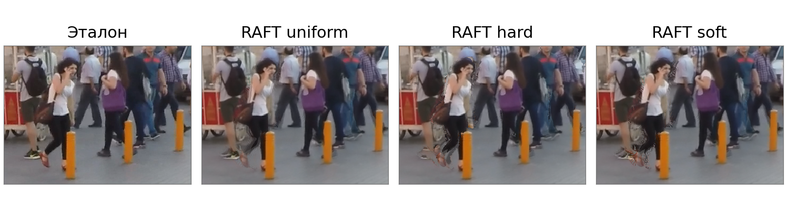

**Аннотация.** Исследовано влияние согласованности прямого и обратного оптического потока на интерполяцию видеокадров с предобученной моделью RAFT. Сопоставлены одинаковые веса геометрически допустимых соответствий, бинарная маска и непрерывное взвешивание. Во всех вариантах сохранены поля движения, билинейный перенос и правило заполнения пропусков. На 1240 тройках SNU-FILM базовый вариант RAFT uniform получил более высокие средние PSNR и SSIM и более низкий LPIPS во всех четырёх режимах сложности. В среднем бинарные веса снизили PSNR на 0,872 дБ, непрерывные — на 0,607 дБ. Доля резервного заполнения составила 1,14% для uniform, 8,32% для hard и 3,98% для soft. При заданных порогах проверка согласованности не улучшила качество рассматриваемой схемы интерполяции.

**Ключевые слова:** интерполяция видеокадров, оптический поток, RAFT, согласованность движения, окклюзии, перенос пикселей.

# 1 Введение

Интерполяция видеокадров восстанавливает изображение для момента времени между двумя наблюдаемыми кадрами. Ошибки оценки движения приводят к смещению деталей, размытию и двоению контуров. При окклюзиях часть поверхности видна только на одном исходном изображении, поэтому объединение двух кадров требует учитывать неодинаковую надёжность соответствий.

В компьютерной графике генератор кадров может получать дополнительные данные от движка. Например, интерфейс AMD FSR Frame Generation предусматривает буфер глубины, векторы движения и параметры камеры [1]. Для обычного RGB-видео такие данные не предоставляются вместе с изображениями. Оптический поток можно оценить по самим кадрам, однако это не делает полученные поля эквивалентными данным графического движка и не устанавливает совместимость с его интерфейсами.

В этой работе рассматривается самостоятельная схема интерполяции с RAFT [2]. Оценка движения и синтез изображения разделены, что позволяет менять правило объединения пикселей при неизменных потоках. Исследовательский вопрос состоит в том, как проверка прямой и обратной согласованности влияет на качество результата и долю областей, для которых требуется резервное заполнение.

Перенос изображений по оптическому потоку уже применяется в интерполяции, в частности в Softmax Splatting [3]. Проверка согласованности также известна: в UnFlow она используется при формировании масок окклюзий для обучения [4]. Здесь эти принципы используются для контролируемого сравнения способов взвешивания.

# 2 Оценка движения и согласованности

Пусть $I_0,I_1:\Omega\rightarrow[0,1]^3$ — исходные RGB-изображения, а $\Omega$ — их общая пиксельная сетка. Требуется восстановить $\widehat I_t$ для $t=0{,}5$. Эталонный средний кадр $I_t$ используется только при вычислении метрик. Применение RAFT в двух направлениях задаёт поля

$$F_{01}=\operatorname{RAFT}(I_0,I_1),\qquad F_{10}=\operatorname{RAFT}(I_1,I_0). \qquad (1)$$

Вектор $F_{01}(\mathbf x)$ выражается в пикселях и указывает смещение из точки $\mathbf x$ первого кадра во второй. Обратный поток задан на сетке второго кадра. Поэтому при проверке согласованности его необходимо выбирать в точке $\mathbf x+F_{01}(\mathbf x)$, а не в исходной точке. Для нецелых координат используется билинейная интерполяция $\mathcal B$:

$$\widetilde F_{10}(\mathbf x)=\mathcal B(F_{10},\mathbf x+F_{01}(\mathbf x)),\qquad
e_0^2(\mathbf x)=\|F_{01}(\mathbf x)+\widetilde F_{10}(\mathbf x)\|_2^2. \qquad (2)$$

Остаток $e_1^2$ вычисляется аналогично с перестановкой направлений. Введём геометрическую маску $V_0$, равную единице, если точка $\mathbf x+F_{01}(\mathbf x)$ находится внутри изображения, и нулю в остальных случаях. Маска $V_1$ определяется симметрично. Эта проверка применяется во всех вариантах, чтобы выход за границы кадра не смешивался с эффектом проверки согласованности.

Для нормирования остатка используем зависимый от движения порог, основанный на критерии UnFlow [4]:

$$D_0(\mathbf x)=\alpha\bigl(\|F_{01}(\mathbf x)\|_2^2+\|\widetilde F_{10}(\mathbf x)\|_2^2\bigr)+\beta. \qquad (3)$$

До эксперимента зафиксированы значения: $\alpha=0{,}01$, $\beta=0{,}5$ пикселя в квадрате. Они соответствуют параметрам критерия в [4], но не считаются оптимальными для интерполяции. На основе одного и того же остатка определяются три веса:

$$w_0^{\mathrm{uniform}}=V_0,\qquad
w_0^{\mathrm{hard}}=V_0\,\mathbf1[e_0^2\leq D_0],\qquad
w_0^{\mathrm{soft}}=V_0\exp(-e_0^2/D_0). \qquad (4)$$

Здесь $\mathbf1[\cdot]$ — индикатор выполнения условия. Формула непрерывного веса задаёт проверяемую эвристику, а не вероятность правильного соответствия. Для второго изображения используются $V_1$, $e_1^2$ и $D_1$. При выходе координаты за границу вес устанавливается в нуль; значение интерполированного обратного потока в такой точке не интерпретируется.

В реализации используются RAFT Large и явно выбранные веса Torchvision C_T_V2, обученные на FlyingChairs и FlyingThings3D [5]. Выполнено 20 итераций уточнения потока и вычисление в float32. Изображения дополняются справа и снизу до размеров, кратных восьми и не меньших 128 пикселей. Значения нормируются в диапазон $[-1,1]$; после оценки потока дополнение удаляется. Изменение масштаба изображения не применяется.

# 3 Формирование промежуточного изображения

Предполагается линейная траектория движения между исходными моментами времени. Пиксель первого кадра переносится в точку $\mathbf x+tF_{01}(\mathbf x)$, второго — в точку $\mathbf x+(1-t)F_{10}(\mathbf x)$. Это прямой перенос из исходного изображения; простая смена знака потока не используется для построения обратного отображения.

Обозначим через $\mathcal S_d(A,w)$ накопление взвешенных значений $A$ в целевой сетке при смещении $d$. Вклад в четыре соседних пикселя определяется билинейным ядром $k(\mathbf z)=\max(0,1-|z_x|)\max(0,1-|z_y|)$:

$$\mathcal S_d(A,w)(\mathbf y)=\sum_{\mathbf x\in\Omega}
k(\mathbf y-\mathbf x-d(\mathbf x))w(\mathbf x)A(\mathbf x). \qquad (5)$$

Вклады за пределами целевой сетки отбрасываются. Введём $d_0=tF_{01}$ и $d_1=(1-t)F_{10}$. Числитель $N_t$ и суммарный вес $Z_t$ вычисляются совместно для обоих изображений:

$$\begin{aligned}
N_t&=(1-t)\mathcal S_{d_0}(I_0,w_0)+t\mathcal S_{d_1}(I_1,w_1),\\
Z_t&=(1-t)\mathcal S_{d_0}(1,w_0)+t\mathcal S_{d_1}(1,w_1).
\end{aligned}\qquad (6)$$

При $Z_t>10^{-8}$ результат равен $N_t/Z_t$. В остальных пикселях применяется одно и то же резервное правило $(1-t)I_0+tI_1$. Оно обеспечивает определённость изображения, но может давать двоение. Поэтому отдельно регистрируется доля пикселей $Z_t\leq10^{-8}$ до заполнения. Различия этой доли показывают, какую часть изображения фактически формирует резервное правило.

При нулевом остатке согласованности бинарный и непрерывный веса совпадают с базовыми на геометрически допустимых соответствиях. Следовательно, в этом случае три схемы дают одинаковое изображение. Различия появляются при несогласованных потоках. Этот частный случай используется для проверки реализации наряду с нулевым движением, целочисленным переносом и субпиксельным распределением вкладов.

# 4 Методика эксперимента

Выполнена проверка на 1240 тройках SNU-FILM: по 310 для Easy, Medium, Hard и Extreme. Средняя величина движения возрастает от Easy к Extreme [6]. По записанным идентификаторам каждая из 31 группы видеопоследовательностей представлена десятью тройками в каждом режиме. Все варианты обработали одинаковые тройки; эталонный средний кадр использовался только для метрик. Пороговые параметры после получения результатов не изменялись. Дополнительный базовый вариант вычислял полусумму входных кадров. Сравнение с готовой моделью RIFE [7] в этот эксперимент не входило.

PSNR вычислялся по средней квадратичной ошибке в RGB с диапазоном $[0,1]$. Для SSIM использовались гауссово окно $11\times11$, $\sigma=1{,}5$, константы $0{,}01$ и $0{,}03$, ковариация с нормированием на число элементов окна и усреднение по каналам [8]. При усреднении карты SSIM исключалась граница шириной пять пикселей. LPIPS вычислялся с AlexNet, версия метрики 0.1 [9]. Метрики и доля резервного заполнения сначала определялись для каждой тройки, затем усреднялись внутри режима. Сводное среднее по всем тройкам при равных размерах режимов также является средним четырёх режимных оценок.

Расчёты проведены на NVIDIA GeForce RTX 3050 Laptop GPU с 6 ГБ памяти. Использованы Python 3.12.3, PyTorch 2.6.0+cu124, Torchvision 0.21.0+cu124, NumPy 2.5.2, SciPy 1.18.1 и пакет LPIPS 0.1.4. В журнале зафиксирован коммит реализации 2e3b7f1 и контрольная сумма весов C_T_V2. Набор содержал восемь исходных разрешений, наибольшее — $1280\times720$; масштабирование не применялось.

Время одного результата включало обе оценки RAFT, передачу данных между CPU и GPU, расчёт весов и синтез. Чтение файлов, загрузка моделей и вычисление метрик исключались. Перед измерением выполнялись два прогревочных прохода для каждого размера. Потоки вычислялись один раз на тройку и повторно использовались для uniform, hard и soft; при учёте времени каждого варианта стоимость потока включалась полностью. Перенос выполнялся на CPU средствами NumPy, поэтому измерения характеризуют смешанную реализацию.

# 5 Результаты

Журнал прогона содержит 4960 записей качества: 1240 троек и четыре варианта. Все 2480 парных разностей hard и soft относительно uniform совпали с разностями исходных записей. Повторное усреднение воспроизвело все значения сводной таблицы.

Таблица 1 Качество интерполяции на SNU-FILM при 310 тройках в каждом режиме

| Режим | Вариант | PSNR, дБ | SSIM | LPIPS | Заполнение, % |
|:--|:--|--:|--:|--:|--:|
| Easy | Усреднение | 32,430 | 0,9038 | 0,0603 | — |
| Easy | RAFT uniform | **37,496** | **0,9787** | **0,0288** | 0,23 |
| Easy | RAFT hard | 36,575 | 0,9767 | 0,0308 | 2,69 |
| Easy | RAFT soft | 36,899 | 0,9776 | 0,0303 | 0,65 |
| Medium | Усреднение | 28,075 | 0,8315 | 0,0909 | — |
| Medium | RAFT uniform | **33,732** | **0,9578** | **0,0433** | 0,54 |
| Medium | RAFT hard | 32,769 | 0,9537 | 0,0470 | 5,55 |
| Medium | RAFT soft | 33,075 | 0,9555 | 0,0465 | 1,67 |
| Hard | Усреднение | 24,509 | 0,7534 | 0,1363 | — |
| Hard | RAFT uniform | **29,087** | **0,8906** | **0,0717** | 1,23 |
| Hard | RAFT hard | 28,211 | 0,8841 | 0,0773 | 10,34 |
| Hard | RAFT soft | 28,461 | 0,8867 | 0,0772 | 4,78 |
| Extreme | Усреднение | 21,643 | 0,6800 | 0,1999 | — |
| Extreme | RAFT uniform | **24,701** | **0,7850** | **0,1205** | 2,57 |
| Extreme | RAFT hard | 23,973 | 0,7770 | 0,1289 | 14,69 |
| Extreme | RAFT soft | 24,154 | 0,7796 | 0,1291 | 8,82 |

В таблице выделены лучшие средние значения PSNR, SSIM и LPIPS внутри режима. «Заполнение» обозначает среднюю долю пикселей, для которых $Z_t\leq10^{-8}$ и применяется полусумма исходных кадров. Для усреднения этот показатель не определяется.

RAFT uniform превосходит усреднение по всем трём метрикам во всех режимах. Его преимущество по PSNR составляет от 3,057 дБ в Extreme до 5,657 дБ в Medium. Введение бинарных или непрерывных весов, напротив, ухудшает средние значения всех трёх метрик относительно uniform в каждом режиме. Потери PSNR составляют 0,728–0,963 дБ для hard и 0,546–0,657 дБ для soft.

При усреднении по 1240 тройкам PSNR равен 31,254 дБ для uniform, 30,382 дБ для hard и 30,647 дБ для soft. Соответствующие значения SSIM — 0,9030, 0,8979 и 0,8998; LPIPS — 0,0661, 0,0710 и 0,0707. Бинарные веса повышают PSNR относительно uniform в 83 случаях из 1240 (6,7%), непрерывные — в 155 (12,5%). При объединении четырёх режимов средняя разность PSNR отрицательна для обоих вариантов в каждой из 31 записанной группы последовательностей. Эти описательные сравнения не требуют считать тройки одной последовательности независимыми.

Доля резервного заполнения растёт вместе со сложностью движения. В Extreme она достигает 2,57% для uniform, 14,69% для hard и 8,82% для soft. В среднем по всему набору значения равны 1,14%, 8,32% и 3,98%. Следовательно, изменение весов заметно увеличивает часть изображения, формируемую простым усреднением. Связь этого увеличения с ухудшением метрик согласуется с гипотезой об удалении полезных вкладов, но сама по себе не устанавливает долю ошибки, вызванную резервным правилом.

На рисунке 1 приведён фрагмент extreme_00001 из группы GOPR0384_11_00. Идентификатор был выбран до полного прогона как первый пример режима; область для иллюстрации выделена при анализе. Во всех вариантах заметны искажения около движущихся людей, а в hard и soft видны дополнительные нарушения контуров ног. Полный кадр имеет PSNR 22,837 дБ для uniform, 22,426 дБ для hard и 22,640 дБ для soft. Иллюстрация показывает один случай и не заменяет оценки по всему набору.

{width=6.8in}

Среднее время составило 2,269 с для uniform, 2,458 с для hard и 2,458 с для soft. Увеличение относительно uniform составляет около 8,3–8,4%. Это описательные значения одного прогона на смешанной CPU/GPU-реализации с восемью разрешениями. Они не характеризуют скорость полностью GPU-реализации и не позволяют делать выводы об энергопотреблении.

# 6 Обсуждение и выводы

Проверка согласованности относится к соответствиям между конечными кадрами. Поверхность, скрытая во втором кадре, ещё может быть видима в промежуточный момент, поэтому её отбрасывание способно удалять полезную информацию. Малая ошибка согласованности также не гарантирует правильного движения: два ошибочных потока могут быть взаимно согласованы. Полученные измерения показывают ограничение использования этого критерия непосредственно как веса синтеза при фиксированном резервном заполнении.

Вывод относится к RAFT Large C_T_V2, параметрам $\alpha=0{,}01$, $\beta=0{,}5$ и заданным формулам весов. Другие пороги, обучаемое объединение изображений и восстановление пропусков не исследовались. Линейная траектория, ошибки потока и простое усреднение в пропусках ограничивают все три варианта. SNU-FILM в данной постановке не даёт оценки временного мерцания и точности масок окклюзий.

В проведённом контролируемом сравнении RAFT uniform получил лучшие средние значения PSNR, SSIM и LPIPS во всех режимах SNU-FILM. Бинарная и непрерывная проверки согласованности увеличили долю резервного заполнения и снизили качество. Следовательно, при этих условиях добавление проверки согласованности в правило взвешивания не даёт преимущества перед геометрической маской.

# Литература

1. AMD. AMD FSR Frame Generation API. Документация. [gpuopen.com](https://gpuopen.com/manuals/fsr_sdk/techniques/frame-interpolation-api/). Дата обращения 17.09.2026.
2. Teed Z., Deng J. RAFT: Recurrent All-Pairs Field Transforms for Optical Flow. ECCV, 2020. [arXiv:2003.12039](https://arxiv.org/abs/2003.12039).
3. Niklaus S., Liu F. Softmax Splatting for Video Frame Interpolation. CVPR, 2020. [arXiv:2003.05534](https://arxiv.org/abs/2003.05534).
4. Meister S., Hur J., Roth S. UnFlow: Unsupervised Learning of Optical Flow with a Bidirectional Census Loss. AAAI, 2018. [arXiv:1711.07837](https://arxiv.org/abs/1711.07837).
5. Torchvision. RAFT Large and Raft_Large_Weights. Документация. [docs.pytorch.org](https://docs.pytorch.org/vision/0.21/models/generated/torchvision.models.optical_flow.raft_large.html). Дата обращения 17.09.2026.
6. Choi M., Kim H., Han B., Xu N., Lee K. M. Channel Attention Is All You Need for Video Frame Interpolation. AAAI, 2020. [Страница статьи и SNU-FILM](https://myungsub.github.io/CAIN/).
7. Huang Z., Zhang T., Heng W., Shi B., Zhou S. Real-Time Intermediate Flow Estimation for Video Frame Interpolation. ECCV, 2022. [arXiv:2011.06294](https://arxiv.org/abs/2011.06294).
8. Wang Z., Bovik A. C., Sheikh H. R., Simoncelli E. P. Image Quality Assessment: From Error Visibility to Structural Similarity. IEEE Transactions on Image Processing, 2004. [Текст статьи](https://www.cns.nyu.edu/pub/eero/wang03-reprint.pdf).
9. Zhang R., Isola P., Efros A. A., Shechtman E., Wang O. The Unreasonable Effectiveness of Deep Features as a Perceptual Metric. CVPR, 2018. [arXiv:1801.03924](https://arxiv.org/abs/1801.03924).
